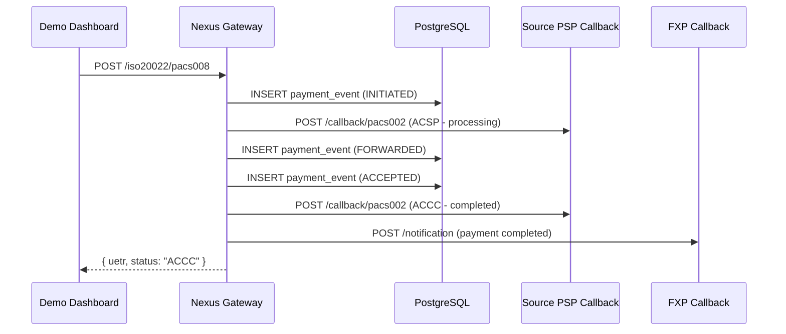

# ADR-010: Payment Lifecycle Persistence Strategy

**Status**: Proposed  
**Date**: 2026-02-03  
**Decision Makers**: Development Team  
**Technical Story**: Define how payment events are persisted and how actors receive callbacks

## Context

The 17-step payment lifecycle must be:
1. Persisted for audit and testing
2. Queryable by UETR
3. Triggering callbacks to registered actors

### Current State (Demo Dashboard)

The `handleSubmit` function currently **simulates** steps 12-17 visually without:
- Calling real `POST /iso20022/pacs008` API
- Persisting payment events to database
- Delivering callbacks to actors

## Decision

### Two-Phase Implementation

#### Phase 1: Visual Simulation (Current - Sandbox Demo)

For immediate demo purposes, frontend animates through steps without backend persistence:

```typescript
// Current: Visual-only simulation
for (let step = 12; step <= 17; step++) {
    advanceStep(step);
    await new Promise((r) => setTimeout(r, 800));
}
advanceStep(18); // Mark step 17 complete
```

**Use case**: Quick demonstrations, UI showcasing

#### Phase 2: Full Persistence (Planned)

Real backend calls with database persistence:

```typescript
// Planned: Real persistence
const pacs008Xml = buildPacs008({
    uetr: crypto.randomUUID(),
    quoteId: selectedQuote.quoteId,
    // ... payment details
});

const response = await fetch('/iso20022/pacs008', {
    method: 'POST',
    headers: { 'Content-Type': 'application/xml' },
    body: pacs008Xml,
});

// Track via UETR
const { uetr } = await response.json();
```

### Database Schema

```sql
-- payment_events table (from migrations/001_initial_schema.sql)
CREATE TABLE payment_events (
    event_id UUID PRIMARY KEY,
    uetr UUID NOT NULL,
    event_type VARCHAR(50) NOT NULL,
    event_data JSONB,
    pacs008_message TEXT,  -- Original XML
    pacs002_message TEXT,  -- Status response XML
    created_at TIMESTAMPTZ DEFAULT NOW()
);

CREATE INDEX idx_payment_events_uetr ON payment_events(uetr);
```

### Actor Callback Flow



### Query Endpoints

```http
# Get all events for a payment
GET /payments/{uetr}/events

# Get payment status
GET /payments/{uetr}/status

# List recent payments (for testing)
GET /payments?limit=20
```

## Implementation Priority

1. ✅ Visual simulation (current)
2. 🔜 `POST /iso20022/pacs008` generates real UETR
3. 🔜 Payment events stored in database
4. 🔜 Actor callback delivery
5. 🔜 Payments Explorer shows real data

## Consequences

### Positive
- Full audit trail for testing
- Actors can verify callback handling
- Payments Explorer shows real transactions
- End-to-end validation possible

### Negative
- More complex implementation
- Database dependency for full testing
- Cleanup needed between tests

## Related Decisions

- [ADR-004](ADR-004-event-sourcing-strategy.md): Event sourcing pattern
- [ADR-008](ADR-008-actor-callback-format.md): Callback format (XML/JSON)
