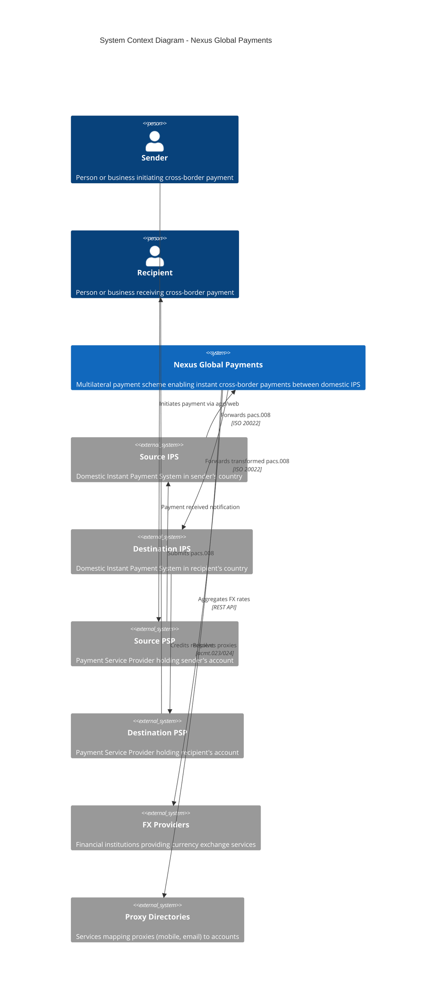
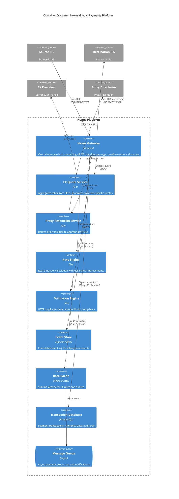
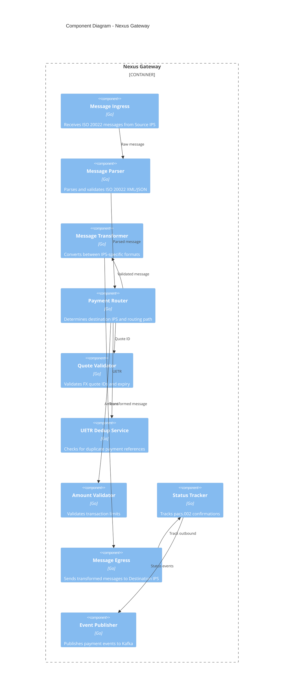
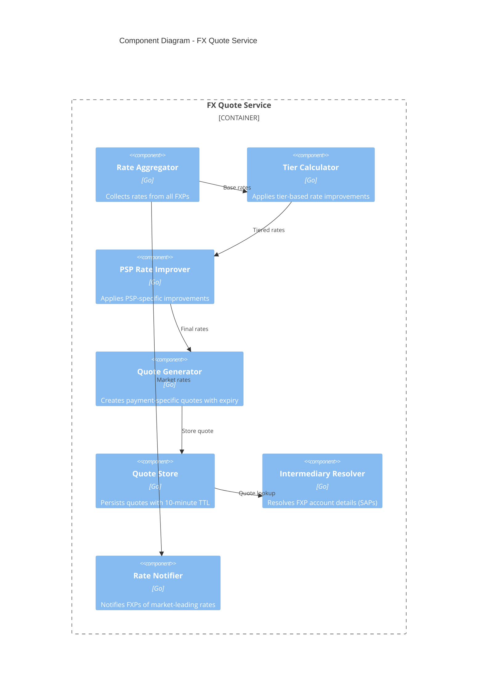
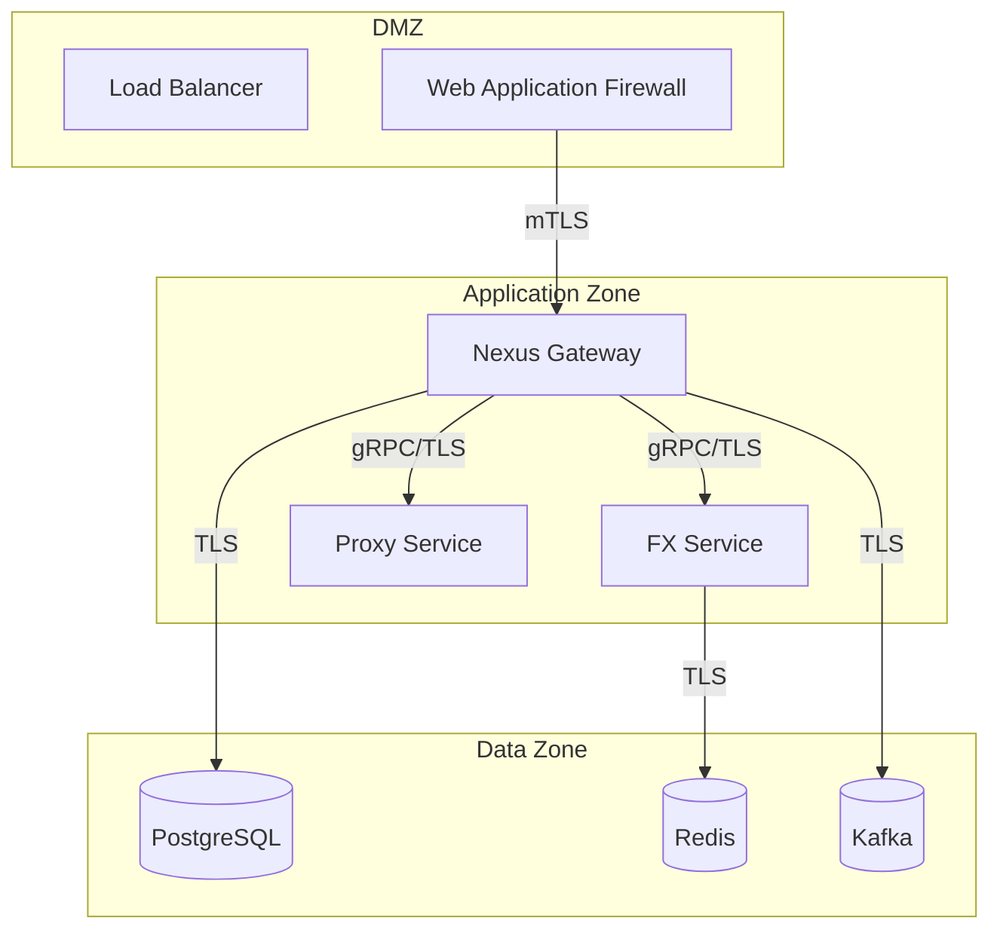
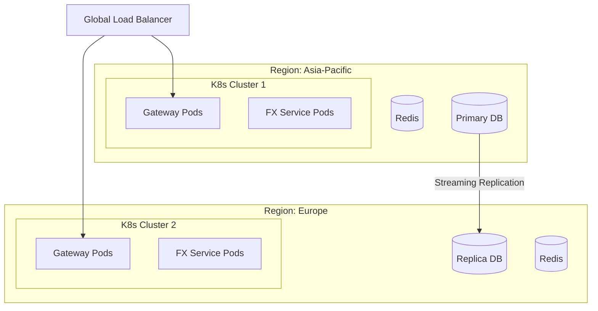

# C4 Architecture: Nexus Global Payments

> This document provides comprehensive C4 model architecture diagrams for the Nexus Global Payments (NGP) cross-border instant payment platform.

> [!NOTE]
> **Sandbox vs Production**: This document describes the **target production architecture** based on official Nexus specifications. The sandbox implementation uses a simplified stack:
> - **Backend**: Python 3.11+ / FastAPI (vs Go/Java in production)
> - **Protocol**: REST/JSON (vs gRPC in production)  
> - **Deployment**: Docker Compose (vs Kubernetes in production)
> - **Messaging**: Direct HTTP callbacks (vs Kafka in production)
>
> See [README.md](../../README.md) for the actual sandbox technology stack.

## Overview

The C4 model (Context, Container, Component, Code) provides a hierarchical approach to describing software architecture. This document covers the first three levels of abstraction for the Nexus system.

---

## Level 1: System Context Diagram

The System Context diagram shows Nexus and its relationship with users and external systems.

### Actors and Responsibilities

| Actor | Type | Description |
|-------|------|-------------|
| **Sender** | Human/Business | Initiates cross-border payment via PSP app |
| **Recipient** | Human/Business | Receives funds in local currency |
| **Source PSP** | External System | Bank/payment institution holding sender's account |
| **Destination PSP** | External System | Bank/payment institution holding recipient's account |
| **Source IPS** | External System | Domestic instant payment system (sender's country) |
| **Destination IPS** | External System | Domestic instant payment system (recipient's country) |
| **FX Providers** | External System | Multi-currency liquidity providers |
| **Proxy Directories** | External System | Mobile/email to account mapping services |

---

## Level 2: Container Diagram

The Container diagram shows the high-level technology choices and how responsibilities are distributed.

### Container Descriptions

| Container | Technology | Purpose |
|-----------|------------|---------|
| **Nexus Gateway** | Go/Java | Central message ingestion, transformation, and routing |
| **FX Quote Service** | Go | Aggregates real-time rates from FXPs, generates quotes |
| **Proxy Resolution Service** | Go | Handles acmt.023/024 proxy lookups |
| **Rate Engine** | Go | Applies tier-based and PSP-specific rate improvements |
| **Validation Engine** | Go | UETR checks, amount limits, compliance validation |
| **Event Store** | Apache Kafka | Immutable event log for audit and event sourcing |
| **Rate Cache** | Redis Cluster | Sub-millisecond rate retrieval for quote generation |
| **Transaction Database** | PostgreSQL 15+ | ACID-compliant transaction ledger |
| **Message Queue** | Apache Kafka | Async notifications to SAPs and FXPs |

---

## Level 3: Component Diagram - Nexus Gateway

### Gateway Components

| Component | Responsibility |
|-----------|----------------|
| **Message Ingress** | TLS termination, receive ISO 20022 from Source IPS |
| **Message Parser** | XML/JSON parsing, schema validation |
| **Message Transformer** | XPath-based message transformation between IPS formats |
| **Payment Router** | Destination lookup, routing decisions |
| **Quote Validator** | Verify quote ID, check expiry, validate rate |
| **UETR Dedup Service** | Prevent duplicate payment processing |
| **Amount Validator** | Check against IPS max amounts |
| **Status Tracker** | Correlate pacs.002 responses |
| **Message Egress** | mTLS connection to Destination IPS |
| **Event Publisher** | Kafka event emission for audit trail |

---

## Level 3: Component Diagram - FX Quote Service

---

## Cross-Cutting Concerns

### Security Boundaries

### Data Flow Patterns

| Pattern | Implementation |
|---------|----------------|
| **Synchronous Query** | REST API for quotes, amounts, countries |
| **Synchronous Command** | pacs.008 payment instruction processing |
| **Async Notification** | camt.054 to FXPs via Kafka → Webhook |
| **Event Sourcing** | All payment state changes as immutable events |

---

## Deployment Topology

---

## Related Documents

- [Event Sourcing Patterns](EVENT_SOURCING.md)
- [Microservices Patterns](MICROSERVICES_PATTERNS.md)
- [PostgreSQL Schema](../database/POSTGRESQL_SCHEMA.md)
- [Kubernetes Deployment](../infrastructure/KUBERNETES_DEPLOYMENT.md)

---

*Generated using C4 Model best practices. Reference: [c4model.com](https://c4model.com)*
