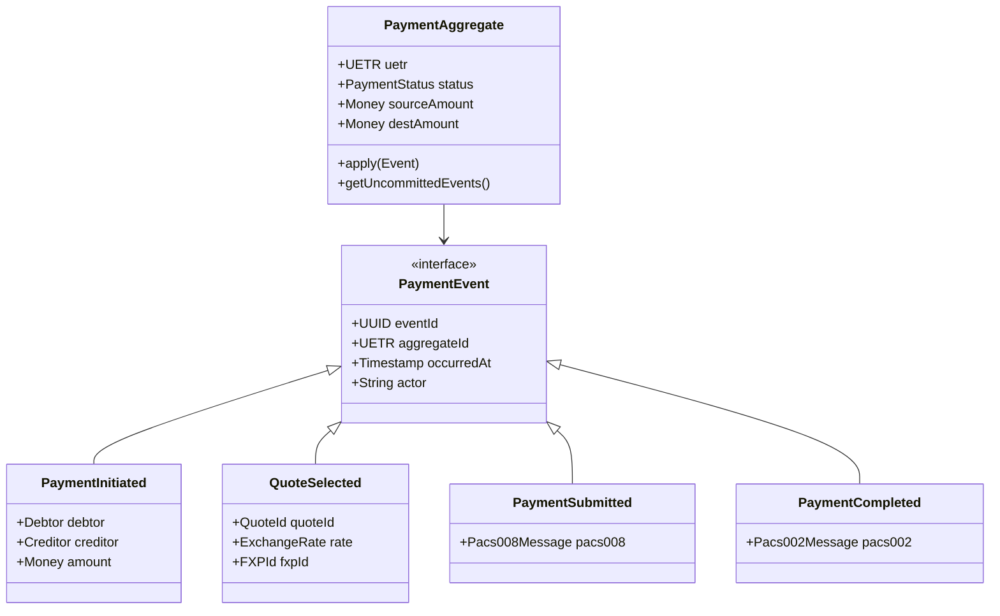
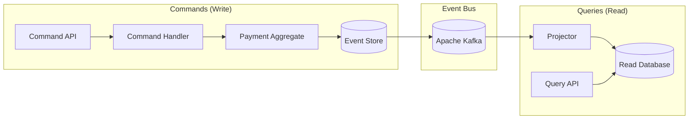
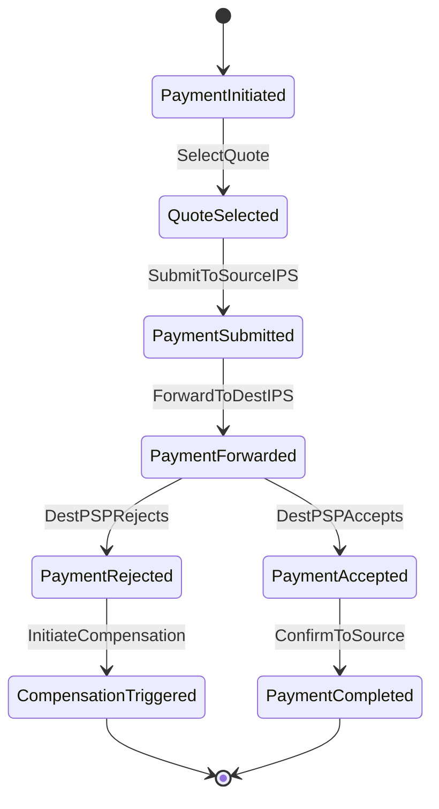

# Event Sourcing & CQRS: Nexus Global Payments

> This document defines the event-sourcing and CQRS patterns for the Nexus Global Payments platform, ensuring immutable audit trails and temporal query capabilities.

> [!NOTE]
> **Sandbox vs Production**: This document describes the **target event-sourcing architecture** in Go/Kafka. The sandbox uses a simplified implementation:
> - **Event Storage**: PostgreSQL `payment_events` table (vs Kafka in production)
> - **Language**: Python/FastAPI (vs Go in production)
> - **Projections**: Direct database updates (vs separate read models)
>
> The sandbox demonstrates the *concepts* of event-driven payment tracking. See the actual implementation in `services/nexus-gateway/src/api/payments.py`.

## Why Event Sourcing for Payments?

| Requirement | Solution |
|-------------|----------|
| **Regulatory Audit Trail** | Immutable event log of all state changes |
| **Temporal Queries** | "What was the payment status at time X?" |
| **Dispute Resolution** | Complete history for reconciliation |
| **Failure Recovery** | Replay events to rebuild state |
| **Cross-border Compliance** | FATF R16, GDPR Article 17 exemption |

---

## 1. Core Concepts

### 1.1 Event Sourcing vs Traditional CRUD

```
┌─────────────────────────────────────────────────────────────────┐
│                    TRADITIONAL CRUD                             │
├─────────────────────────────────────────────────────────────────┤
│  Payment { status: "COMPLETED", amount: 1000 }                  │
│  (Only current state; history lost)                            │
└─────────────────────────────────────────────────────────────────┘

┌─────────────────────────────────────────────────────────────────┐
│                    EVENT SOURCING                               │
├─────────────────────────────────────────────────────────────────┤
│  PaymentInitiated   { uetr: "abc", amount: 1000, ts: T1 }      │
│  QuoteSelected      { uetr: "abc", quote_id: "xyz", ts: T2 }   │
│  PaymentSubmitted   { uetr: "abc", pacs008: {...}, ts: T3 }    │
│  PaymentForwarded   { uetr: "abc", dest_ips: "TH", ts: T4 }    │
│  PaymentAccepted    { uetr: "abc", pacs002: {...}, ts: T5 }    │
│  PaymentCompleted   { uetr: "abc", ts: T6 }                    │
│  (Complete history preserved)                                   │
└─────────────────────────────────────────────────────────────────┘
```

### 1.2 Aggregates and Events



---

## 2. Event Definitions

### 2.1 Payment Lifecycle Events

| Event | Triggered By | Data Captured |
|-------|--------------|---------------|
| `PaymentInitiated` | Sender confirms payment | Debtor, creditor, amounts, purpose |
| `QuoteSelected` | PSP selects FX quote | Quote ID, rate, FXP, SAP accounts |
| `PaymentSubmitted` | PSP sends to Source IPS | pacs.008 message, UETR, timestamp |
| `PaymentForwarded` | Nexus forwards to Dest IPS | Transformed pacs.008, destination |
| `PaymentAccepted` | Dest PSP accepts payment | pacs.002 ACCC status |
| `PaymentRejected` | Dest PSP rejects payment | pacs.002 RJCT, reason code |
| `PaymentBlocked` | Compliance screening | Blocking reason, matched list |
| `PaymentCompleted` | End-to-end confirmation | Final timestamps, confirmation |
| `PaymentReturned` | Return initiated | Return reason, return pacs.004 |

### 2.2 Event Schema (JSON)

```json
{
  "$schema": "http://json-schema.org/draft-07/schema#",
  "title": "PaymentEvent",
  "type": "object",
  "required": ["eventId", "eventType", "aggregateId", "occurredAt", "actor", "version"],
  "properties": {
    "eventId": {
      "type": "string",
      "format": "uuid"
    },
    "eventType": {
      "type": "string",
      "enum": [
        "PaymentInitiated",
        "QuoteSelected",
        "PaymentSubmitted",
        "PaymentForwarded",
        "PaymentAccepted",
        "PaymentRejected",
        "PaymentBlocked",
        "PaymentCompleted",
        "PaymentReturned"
      ]
    },
    "aggregateId": {
      "type": "string",
      "format": "uuid",
      "description": "UETR of the payment"
    },
    "occurredAt": {
      "type": "string",
      "format": "date-time"
    },
    "actor": {
      "type": "string",
      "description": "BIC of acting institution or 'NEXUS'"
    },
    "version": {
      "type": "integer",
      "minimum": 1
    },
    "correlationId": {
      "type": "string",
      "format": "uuid"
    },
    "data": {
      "type": "object"
    }
  }
}
```

### 2.3 Example Event

```json
{
  "eventId": "550e8400-e29b-41d4-a716-446655440001",
  "eventType": "PaymentSubmitted",
  "aggregateId": "f47ac10b-58cc-4372-a567-0e02b2c3d479",
  "occurredAt": "2025-03-15T10:30:00.123Z",
  "actor": "DBSSSGSG",
  "version": 3,
  "correlationId": "123e4567-e89b-12d3-a456-426614174000",
  "data": {
    "sourcePspBic": "DBSSSGSG",
    "sourceCountry": "SG",
    "destinationCountry": "TH",
    "sourceCurrency": "SGD",
    "destinationCurrency": "THB",
    "sourceAmount": 1000.00,
    "destinationAmount": 25850.00,
    "exchangeRate": 25.85,
    "quoteId": "q-12345",
    "fxpId": "fxp-xyz",
    "priority": "NORM",
    "messageId": "MSG-2025-001"
  }
}
```

---

## 3. CQRS Architecture

### 3.1 Command and Query Separation



### 3.2 Command Handlers

```go
package commands

import (
    "context"
    "time"
)

// SubmitPaymentCommand represents the command to submit a payment
type SubmitPaymentCommand struct {
    UETR              string
    SourcePSP         string
    DestinationPSP    string
    DebtorName        string
    DebtorAccount     string
    CreditorName      string
    CreditorAccount   string
    SourceAmount      float64
    SourceCurrency    string
    DestinationAmount float64
    DestinationCurrency string
    QuoteID           string
    Priority          string
}

// SubmitPaymentHandler handles payment submission
type SubmitPaymentHandler struct {
    eventStore EventStore
    fxService  FXService
}

func (h *SubmitPaymentHandler) Handle(ctx context.Context, cmd SubmitPaymentCommand) error {
    // Load aggregate from event store
    events, err := h.eventStore.LoadEvents(ctx, cmd.UETR)
    if err != nil {
        return err
    }
    
    aggregate := NewPaymentAggregate(cmd.UETR)
    for _, event := range events {
        aggregate.Apply(event)
    }
    
    // Validate quote
    quote, err := h.fxService.ValidateQuote(ctx, cmd.QuoteID)
    if err != nil {
        return err
    }
    
    // Apply command to generate new events
    event := PaymentSubmittedEvent{
        EventID:     uuid.New(),
        AggregateID: cmd.UETR,
        OccurredAt:  time.Now(),
        Actor:       cmd.SourcePSP,
        Version:     aggregate.Version + 1,
        Data: PaymentSubmittedData{
            SourcePSP:         cmd.SourcePSP,
            QuoteID:           cmd.QuoteID,
            ExchangeRate:      quote.Rate,
            SourceAmount:      cmd.SourceAmount,
            DestinationAmount: cmd.DestinationAmount,
        },
    }
    
    aggregate.Apply(event)
    
    // Persist new events
    return h.eventStore.AppendEvents(ctx, cmd.UETR, []Event{event})
}
```

### 3.3 Event Store Interface

```go
package eventstore

import (
    "context"
)

// EventStore defines the interface for event persistence
type EventStore interface {
    // LoadEvents loads all events for an aggregate
    LoadEvents(ctx context.Context, aggregateID string) ([]Event, error)
    
    // LoadEventsFromVersion loads events starting from a specific version
    LoadEventsFromVersion(ctx context.Context, aggregateID string, fromVersion int) ([]Event, error)
    
    // AppendEvents atomically appends events (optimistic concurrency)
    AppendEvents(ctx context.Context, aggregateID string, events []Event) error
    
    // LoadSnapshot loads the latest snapshot for fast aggregate reconstruction
    LoadSnapshot(ctx context.Context, aggregateID string) (*Snapshot, error)
    
    // SaveSnapshot persists a snapshot
    SaveSnapshot(ctx context.Context, snapshot Snapshot) error
}

// PostgreSQL implementation
type PostgresEventStore struct {
    db *sql.DB
}

func (s *PostgresEventStore) AppendEvents(ctx context.Context, aggregateID string, events []Event) error {
    tx, err := s.db.BeginTx(ctx, nil)
    if err != nil {
        return err
    }
    defer tx.Rollback()
    
    // Check optimistic concurrency
    var currentVersion int
    err = tx.QueryRowContext(ctx,
        `SELECT COALESCE(MAX(version), 0) FROM payment_events WHERE uetr = $1`,
        aggregateID,
    ).Scan(&currentVersion)
    if err != nil {
        return err
    }
    
    expectedVersion := events[0].GetVersion() - 1
    if currentVersion != expectedVersion {
        return ErrConcurrencyConflict
    }
    
    // Insert events
    for _, event := range events {
        _, err = tx.ExecContext(ctx,
            `INSERT INTO payment_events 
             (event_id, uetr, event_type, version, actor, event_data, occurred_at)
             VALUES ($1, $2, $3, $4, $5, $6, $7)`,
            event.GetID(),
            aggregateID,
            event.GetType(),
            event.GetVersion(),
            event.GetActor(),
            event.GetData(),
            event.GetOccurredAt(),
        )
        if err != nil {
            return err
        }
    }
    
    return tx.Commit()
}
```

---

## 4. Projections (Read Models)

### 4.1 Payment Status Projection

```go
package projections

import (
    "context"
    "database/sql"
)

// PaymentStatusProjector builds the payment status read model
type PaymentStatusProjector struct {
    db *sql.DB
}

func (p *PaymentStatusProjector) Handle(ctx context.Context, event Event) error {
    switch e := event.(type) {
    case *PaymentInitiatedEvent:
        return p.handleInitiated(ctx, e)
    case *PaymentSubmittedEvent:
        return p.handleSubmitted(ctx, e)
    case *PaymentCompletedEvent:
        return p.handleCompleted(ctx, e)
    case *PaymentRejectedEvent:
        return p.handleRejected(ctx, e)
    default:
        return nil
    }
}

func (p *PaymentStatusProjector) handleInitiated(ctx context.Context, e *PaymentInitiatedEvent) error {
    _, err := p.db.ExecContext(ctx,
        `INSERT INTO payment_status_view 
         (uetr, status, source_psp, source_country, dest_country, 
          debtor_name, creditor_name, source_amount, source_currency,
          created_at, last_updated)
         VALUES ($1, $2, $3, $4, $5, $6, $7, $8, $9, $10, $10)`,
        e.AggregateID,
        "INITIATED",
        e.Data.SourcePSP,
        e.Data.SourceCountry,
        e.Data.DestinationCountry,
        e.Data.DebtorName,
        e.Data.CreditorName,
        e.Data.SourceAmount,
        e.Data.SourceCurrency,
        e.OccurredAt,
    )
    return err
}

func (p *PaymentStatusProjector) handleCompleted(ctx context.Context, e *PaymentCompletedEvent) error {
    _, err := p.db.ExecContext(ctx,
        `UPDATE payment_status_view 
         SET status = 'COMPLETED', 
             completed_at = $2, 
             last_updated = $2,
             total_duration_ms = EXTRACT(EPOCH FROM ($2 - created_at)) * 1000
         WHERE uetr = $1`,
        e.AggregateID,
        e.OccurredAt,
    )
    return err
}
```

### 4.2 Read Model Schema

```sql
-- Optimized read model for payment queries
CREATE TABLE payment_status_view (
    uetr UUID PRIMARY KEY,
    status TEXT NOT NULL,
    source_psp TEXT NOT NULL,
    destination_psp TEXT,
    source_country CHAR(2) NOT NULL,
    dest_country CHAR(2) NOT NULL,
    
    -- Debtor/Creditor
    debtor_name TEXT NOT NULL,
    debtor_account TEXT,
    creditor_name TEXT,
    creditor_account TEXT,
    
    -- Amounts
    source_amount NUMERIC(18, 2) NOT NULL,
    source_currency CHAR(3) NOT NULL,
    dest_amount NUMERIC(18, 2),
    dest_currency CHAR(3),
    exchange_rate NUMERIC(18, 10),
    
    -- FX Details
    quote_id UUID,
    fxp_id BIGINT,
    
    -- Timing
    created_at TIMESTAMPTZ NOT NULL,
    submitted_at TIMESTAMPTZ,
    completed_at TIMESTAMPTZ,
    last_updated TIMESTAMPTZ NOT NULL,
    total_duration_ms INTEGER,
    
    -- Error handling
    rejection_reason TEXT,
    rejection_code TEXT
);

-- Indexes for common queries
CREATE INDEX idx_payment_status_source_psp ON payment_status_view(source_psp, created_at DESC);
CREATE INDEX idx_payment_status_status ON payment_status_view(status) WHERE status NOT IN ('COMPLETED', 'REJECTED');
CREATE INDEX idx_payment_status_corridor ON payment_status_view(source_country, dest_country, created_at DESC);
```

---

## 5. Snapshotting

### 5.1 Snapshot Strategy

```go
const SnapshotThreshold = 100 // Snapshot every 100 events

type PaymentSnapshot struct {
    AggregateID string
    Version     int
    State       PaymentState
    CreatedAt   time.Time
}

func (a *PaymentAggregate) ShouldSnapshot() bool {
    return a.Version%SnapshotThreshold == 0
}

func (a *PaymentAggregate) ToSnapshot() PaymentSnapshot {
    return PaymentSnapshot{
        AggregateID: a.UETR,
        Version:     a.Version,
        State: PaymentState{
            Status:            a.Status,
            SourceAmount:      a.SourceAmount,
            DestinationAmount: a.DestinationAmount,
            ExchangeRate:      a.ExchangeRate,
            // ... other state fields
        },
        CreatedAt: time.Now(),
    }
}

func (a *PaymentAggregate) FromSnapshot(snapshot PaymentSnapshot) {
    a.UETR = snapshot.AggregateID
    a.Version = snapshot.Version
    a.Status = snapshot.State.Status
    // ... restore other fields
}
```

---

## 6. Event Versioning

### 6.1 Schema Evolution

```go
// Version 1 of PaymentSubmittedEvent
type PaymentSubmittedEventV1 struct {
    SourcePSP    string
    Amount       float64
    Currency     string
}

// Version 2 adds destination details
type PaymentSubmittedEventV2 struct {
    SourcePSP         string
    SourceAmount      float64
    SourceCurrency    string
    DestinationAmount float64  // New field
    DestinationCurrency string // New field
}

// Upcaster transforms V1 to V2
func UpcastPaymentSubmittedV1ToV2(v1 PaymentSubmittedEventV1, fx FXService) PaymentSubmittedEventV2 {
    destAmount := fx.Convert(v1.Amount, v1.Currency, "USD") // Default to USD
    return PaymentSubmittedEventV2{
        SourcePSP:           v1.SourcePSP,
        SourceAmount:        v1.Amount,
        SourceCurrency:      v1.Currency,
        DestinationAmount:   destAmount,
        DestinationCurrency: "USD",
    }
}
```

---

## 7. Saga Orchestration

### 7.1 Cross-Border Payment Saga



### 7.2 Saga Implementation

```go
package sagas

type CrossBorderPaymentSaga struct {
    eventStore    EventStore
    commandBus    CommandBus
    currentState  string
    compensation  []Command
}

func (s *CrossBorderPaymentSaga) Handle(event Event) error {
    switch s.currentState {
    case "INITIATED":
        if _, ok := event.(*QuoteSelectedEvent); ok {
            s.currentState = "QUOTE_SELECTED"
            s.compensation = append(s.compensation, ReleaseQuoteCommand{})
            return s.commandBus.Send(SubmitPaymentCommand{})
        }
    
    case "SUBMITTED":
        if e, ok := event.(*PaymentRejectedEvent); ok {
            // Trigger compensation
            return s.executeCompensation(e.Reason)
        }
        if _, ok := event.(*PaymentAcceptedEvent); ok {
            s.currentState = "ACCEPTED"
            return s.commandBus.Send(CompletePaymentCommand{})
        }
    }
    return nil
}

func (s *CrossBorderPaymentSaga) executeCompensation(reason string) error {
    // Execute compensation commands in reverse order
    for i := len(s.compensation) - 1; i >= 0; i-- {
        if err := s.commandBus.Send(s.compensation[i]); err != nil {
            return err
        }
    }
    return nil
}
```

---

## 8. Best Practices

### 8.1 Event Design Rules

| Rule | Rationale |
|------|-----------|
| Events are facts | Never delete or modify committed events |
| Events are named in past tense | `PaymentCompleted`, not `CompletePayment` |
| Events are small and focused | One fact per event |
| Events include actor and timestamp | Audit trail requirements |
| Events are versioned from day one | Enable schema evolution |

### 8.2 Idempotency

```go
// Ensure event handlers are idempotent
func (p *Projector) HandleWithIdempotency(ctx context.Context, event Event) error {
    // Check if event already processed
    processed, err := p.isEventProcessed(ctx, event.GetID())
    if err != nil {
        return err
    }
    if processed {
        return nil // Already handled, skip
    }
    
    // Handle event
    if err := p.Handle(ctx, event); err != nil {
        return err
    }
    
    // Mark as processed
    return p.markEventProcessed(ctx, event.GetID())
}
```

---

## Related Documents

- [C4 Architecture](C4_ARCHITECTURE.md)
- [PostgreSQL Schema](../database/POSTGRESQL_SCHEMA.md)
- [Observability](../infrastructure/OBSERVABILITY.md)

---

*Event sourcing patterns aligned with domain-driven design and CQRS best practices.*
