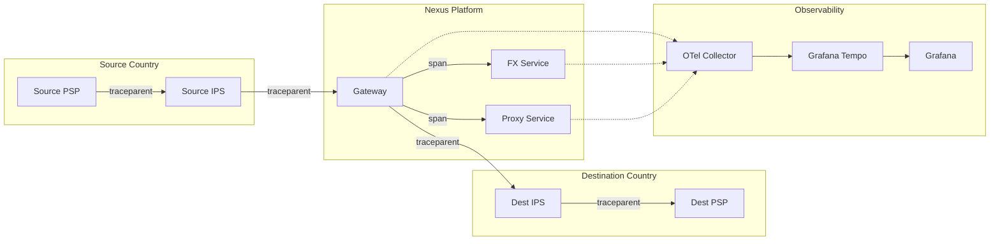

# Observability: Nexus Global Payments

> This document defines the observability stack for Nexus Global Payments, covering distributed tracing, metrics collection, SLO implementation, and alerting strategies.

## Observability Pillars

| Pillar | Technology | Purpose |
|--------|------------|---------|
| **Tracing** | OpenTelemetry → Jaeger/Tempo | End-to-end payment tracing |
| **Metrics** | OpenTelemetry → Prometheus | System and business metrics |
| **Logging** | Fluent Bit → Loki | Centralized log aggregation |
| **Visualization** | Grafana | Dashboards and alerting |

---

## 1. Distributed Tracing

### 1.1 Trace Architecture



### 1.2 Trace Context Propagation

All Nexus services propagate W3C Trace Context headers:

```
traceparent: 00-{trace-id}-{span-id}-{trace-flags}
tracestate: nexus=payment-id:{uetr}
```

Example:
```
traceparent: 00-0af7651916cd43dd8448eb211c80319c-b7ad6b7169203331-01
tracestate: nexus=payment-id:f47ac10b-58cc-4372-a567-0e02b2c3d479
```

### 1.3 OpenTelemetry Configuration

```yaml
# otel-collector-config.yaml
receivers:
  otlp:
    protocols:
      grpc:
        endpoint: 0.0.0.0:4317
      http:
        endpoint: 0.0.0.0:4318

processors:
  batch:
    timeout: 1s
    send_batch_size: 1024
  
  # Add payment context to spans
  attributes:
    actions:
      - key: nexus.payment.uetr
        from_context: uetr
        action: upsert
      - key: nexus.payment.source_country
        from_context: source_country
        action: upsert
  
  # Tail-based sampling for cost optimization
  tail_sampling:
    decision_wait: 10s
    num_traces: 100000
    policies:
      - name: errors
        type: status_code
        status_code: { status_codes: [ERROR] }
      - name: slow-traces
        type: latency
        latency: { threshold_ms: 5000 }
      - name: payment-traces
        type: string_attribute
        string_attribute:
          key: nexus.payment.uetr
          values: ["*"]
      - name: probabilistic
        type: probabilistic
        probabilistic: { sampling_percentage: 5 }

exporters:
  otlp/tempo:
    endpoint: tempo.nexus-observability:4317
    tls:
      insecure: false
      cert_file: /etc/otel/certs/client.crt
      key_file: /etc/otel/certs/client.key
  
  prometheus:
    endpoint: 0.0.0.0:8889
    namespace: nexus
    send_timestamps: true
    metric_expiration: 180m

service:
  pipelines:
    traces:
      receivers: [otlp]
      processors: [batch, attributes, tail_sampling]
      exporters: [otlp/tempo]
    metrics:
      receivers: [otlp]
      processors: [batch]
      exporters: [prometheus]
```

### 1.4 Application Instrumentation (Go)

```go
package tracing

import (
    "context"
    "go.opentelemetry.io/otel"
    "go.opentelemetry.io/otel/attribute"
    "go.opentelemetry.io/otel/trace"
)

var tracer = otel.Tracer("nexus-gateway")

// TracePayment creates a span for payment processing
func TracePayment(ctx context.Context, uetr, sourceCountry, destCountry string) (context.Context, trace.Span) {
    ctx, span := tracer.Start(ctx, "process_payment",
        trace.WithAttributes(
            attribute.String("nexus.payment.uetr", uetr),
            attribute.String("nexus.payment.source_country", sourceCountry),
            attribute.String("nexus.payment.dest_country", destCountry),
            attribute.String("nexus.service", "gateway"),
        ),
    )
    return ctx, span
}

// TraceFXQuote creates a span for FX quote retrieval
func TraceFXQuote(ctx context.Context, sourceCurrency, destCurrency string, amount float64) (context.Context, trace.Span) {
    ctx, span := tracer.Start(ctx, "get_fx_quote",
        trace.WithAttributes(
            attribute.String("fx.source_currency", sourceCurrency),
            attribute.String("fx.dest_currency", destCurrency),
            attribute.Float64("fx.amount", amount),
        ),
    )
    return ctx, span
}

// RecordPaymentEvent adds an event to the current span
func RecordPaymentEvent(ctx context.Context, eventName string, attrs ...attribute.KeyValue) {
    span := trace.SpanFromContext(ctx)
    span.AddEvent(eventName, trace.WithAttributes(attrs...))
}
```

---

## 2. Metrics Collection

### 2.1 Key Metrics Categories

| Category | Metrics | Use Case |
|----------|---------|----------|
| **RED Metrics** | Rate, Errors, Duration | Service health |
| **Payment Metrics** | Count, Value, Status | Business KPIs |
| **FX Metrics** | Quote rate, Spread, Latency | FXP performance |
| **Infrastructure** | CPU, Memory, Connections | Capacity planning |

### 2.2 Prometheus Configuration

```yaml
# prometheus.yaml
global:
  scrape_interval: 15s
  evaluation_interval: 15s
  external_labels:
    cluster: nexus-apac
    region: singapore

rule_files:
  - /etc/prometheus/rules/*.yaml

alerting:
  alertmanagers:
    - static_configs:
        - targets:
            - alertmanager:9093

scrape_configs:
  # Kubernetes service discovery
  - job_name: 'kubernetes-pods'
    kubernetes_sd_configs:
      - role: pod
        namespaces:
          names:
            - nexus-gateway
            - nexus-fx
            - nexus-proxy
    relabel_configs:
      - source_labels: [__meta_kubernetes_pod_annotation_prometheus_io_scrape]
        action: keep
        regex: true
      - source_labels: [__meta_kubernetes_pod_annotation_prometheus_io_port]
        action: replace
        target_label: __address__
        replacement: ${1}:${2}
        regex: (.+);(.+)
  
  # OpenTelemetry Collector metrics
  - job_name: 'otel-collector'
    static_configs:
      - targets: ['otel-collector:8889']
```

### 2.3 Custom Metrics (Go)

```go
package metrics

import (
    "github.com/prometheus/client_golang/prometheus"
    "github.com/prometheus/client_golang/prometheus/promauto"
)

var (
    // Payment metrics
    PaymentsTotal = promauto.NewCounterVec(
        prometheus.CounterOpts{
            Namespace: "nexus",
            Subsystem: "payments",
            Name:      "total",
            Help:      "Total number of payments processed",
        },
        []string{"source_country", "dest_country", "status"},
    )
    
    PaymentDuration = promauto.NewHistogramVec(
        prometheus.HistogramOpts{
            Namespace: "nexus",
            Subsystem: "payments",
            Name:      "duration_seconds",
            Help:      "Payment processing duration in seconds",
            Buckets:   []float64{1, 5, 10, 30, 60, 120, 300},
        },
        []string{"source_country", "dest_country", "priority"},
    )
    
    PaymentValue = promauto.NewHistogramVec(
        prometheus.HistogramOpts{
            Namespace: "nexus",
            Subsystem: "payments",
            Name:      "value_usd",
            Help:      "Payment value in USD equivalent",
            Buckets:   []float64{10, 100, 1000, 10000, 100000, 1000000},
        },
        []string{"source_currency", "dest_currency"},
    )
    
    // FX metrics
    FXQuoteLatency = promauto.NewHistogramVec(
        prometheus.HistogramOpts{
            Namespace: "nexus",
            Subsystem: "fx",
            Name:      "quote_latency_ms",
            Help:      "FX quote retrieval latency in milliseconds",
            Buckets:   []float64{10, 50, 100, 200, 500, 1000, 2000},
        },
        []string{"currency_pair", "fxp_id"},
    )
    
    FXSpread = promauto.NewGaugeVec(
        prometheus.GaugeOpts{
            Namespace: "nexus",
            Subsystem: "fx",
            Name:      "spread_bps",
            Help:      "Current FX spread in basis points",
        },
        []string{"currency_pair", "fxp_id"},
    )
    
    // System metrics
    ActiveConnections = promauto.NewGaugeVec(
        prometheus.GaugeOpts{
            Namespace: "nexus",
            Subsystem: "gateway",
            Name:      "active_connections",
            Help:      "Number of active IPS connections",
        },
        []string{"ips_country", "direction"},
    )
)
```

---

## 3. SLO Implementation

### 3.1 Service Level Objectives

| SLI | SLO Target | Measurement |
|-----|------------|-------------|
| **Payment Completion Time** | 99% < 60s | Histogram p99 |
| **Payment Success Rate** | 99.9% | Counter ratio |
| **Gateway Availability** | 99.95% | Uptime probe |
| **Quote API Latency** | 99% < 500ms | Histogram p99 |
| **Error Rate** | < 0.1% | Counter ratio |

### 3.2 SLO Recording Rules

```yaml
# slo-rules.yaml
groups:
  - name: nexus_slo_recording
    interval: 30s
    rules:
      # Payment completion time SLI
      - record: nexus:payment_completion_time:p99
        expr: |
          histogram_quantile(0.99, 
            sum(rate(nexus_payments_duration_seconds_bucket[5m])) by (le)
          )
      
      # Payment success rate SLI
      - record: nexus:payment_success_rate:ratio
        expr: |
          sum(rate(nexus_payments_total{status="COMPLETED"}[5m])) /
          sum(rate(nexus_payments_total[5m]))
      
      # Quote latency SLI
      - record: nexus:fx_quote_latency:p99
        expr: |
          histogram_quantile(0.99,
            sum(rate(nexus_fx_quote_latency_ms_bucket[5m])) by (le)
          )
      
      # Error budget calculation
      - record: nexus:payment_error_budget:remaining
        expr: |
          1 - (
            (1 - nexus:payment_success_rate:ratio) / 
            (1 - 0.999)  # 99.9% SLO
          )
```

### 3.3 Error Budget Alerts

```yaml
# slo-alerts.yaml
groups:
  - name: nexus_slo_alerts
    rules:
      # Fast burn alert (1h window)
      - alert: NexusPaymentErrorBudgetFastBurn
        expr: |
          nexus:payment_error_budget:remaining < 0.5
          and
          (1 - nexus:payment_success_rate:ratio) > (14.4 * 0.001)
        for: 5m
        labels:
          severity: critical
          team: payments
        annotations:
          summary: "Payment error budget burning fast"
          description: "Error budget at {{ $value | humanizePercentage }}, burning >14.4x normal rate"
          runbook_url: "https://runbooks.nexus/slo/payment-error-budget"
      
      # Slow burn alert (6h window)
      - alert: NexusPaymentErrorBudgetSlowBurn
        expr: |
          nexus:payment_error_budget:remaining < 0.8
          and
          (1 - nexus:payment_success_rate:ratio) > (6 * 0.001)
        for: 30m
        labels:
          severity: warning
          team: payments
        annotations:
          summary: "Payment error budget burning steadily"
          description: "Error budget at {{ $value | humanizePercentage }}"
      
      # Payment latency SLO breach
      - alert: NexusPaymentLatencySLOBreach
        expr: |
          nexus:payment_completion_time:p99 > 60
        for: 5m
        labels:
          severity: warning
          team: payments
        annotations:
          summary: "Payment p99 latency exceeds 60s SLO"
          description: "Current p99: {{ $value | humanizeDuration }}"
      
      # Quote API latency alert
      - alert: NexusFXQuoteLatencyHigh
        expr: |
          nexus:fx_quote_latency:p99 > 500
        for: 5m
        labels:
          severity: warning
          team: fx
        annotations:
          summary: "FX Quote API p99 latency exceeds 500ms"
```

---

## 4. Grafana Dashboards

### 4.1 Executive Dashboard

```json
{
  "title": "Nexus Executive Dashboard",
  "panels": [
    {
      "title": "Payments per Hour",
      "type": "stat",
      "targets": [
        {
          "expr": "sum(increase(nexus_payments_total{status=\"COMPLETED\"}[1h]))"
        }
      ]
    },
    {
      "title": "Payment Success Rate (24h)",
      "type": "gauge",
      "targets": [
        {
          "expr": "sum(rate(nexus_payments_total{status=\"COMPLETED\"}[24h])) / sum(rate(nexus_payments_total[24h])) * 100"
        }
      ],
      "fieldConfig": {
        "thresholds": {
          "steps": [
            { "value": 0, "color": "red" },
            { "value": 99, "color": "yellow" },
            { "value": 99.9, "color": "green" }
          ]
        }
      }
    },
    {
      "title": "P99 Payment Time",
      "type": "stat",
      "targets": [
        {
          "expr": "nexus:payment_completion_time:p99"
        }
      ],
      "unit": "s"
    },
    {
      "title": "Total Payment Volume (24h USD)",
      "type": "stat",
      "targets": [
        {
          "expr": "sum(increase(nexus_payments_value_usd_sum[24h]))"
        }
      ],
      "unit": "currencyUSD"
    }
  ]
}
```

### 4.2 Payment Flow Dashboard

```json
{
  "title": "Nexus Payment Flow",
  "panels": [
    {
      "title": "Payment Status Distribution",
      "type": "piechart",
      "targets": [
        {
          "expr": "sum by (status) (increase(nexus_payments_total[1h]))"
        }
      ]
    },
    {
      "title": "Payment Duration Heatmap",
      "type": "heatmap",
      "targets": [
        {
          "expr": "sum(rate(nexus_payments_duration_seconds_bucket[5m])) by (le)"
        }
      ]
    },
    {
      "title": "Payments by Corridor",
      "type": "table",
      "targets": [
        {
          "expr": "topk(10, sum by (source_country, dest_country) (increase(nexus_payments_total[1h])))"
        }
      ]
    }
  ]
}
```

---

## 5. Log Aggregation

### 5.1 Fluent Bit Configuration

```yaml
# fluent-bit.yaml
[SERVICE]
    Flush         1
    Log_Level     info
    Parsers_File  parsers.conf

[INPUT]
    Name              tail
    Path              /var/log/containers/nexus-*.log
    Parser            docker
    Tag               kube.*
    Mem_Buf_Limit     50MB

[FILTER]
    Name              kubernetes
    Match             kube.*
    Kube_URL          https://kubernetes.default.svc:443
    Kube_CA_File      /var/run/secrets/kubernetes.io/serviceaccount/ca.crt
    Kube_Token_File   /var/run/secrets/kubernetes.io/serviceaccount/token
    Merge_Log         On
    K8S-Logging.Parser On

[FILTER]
    Name              modify
    Match             *
    Add               cluster nexus-apac
    Add               region singapore

[OUTPUT]
    Name              loki
    Match             *
    Host              loki.nexus-observability
    Port              3100
    Labels            job=nexus,cluster=$cluster,namespace=$kubernetes['namespace_name'],pod=$kubernetes['pod_name']
    Auto_Kubernetes_Labels on
```

### 5.2 Structured Logging (Go)

```go
package logging

import (
    "context"
    "go.uber.org/zap"
    "go.uber.org/zap/zapcore"
    "go.opentelemetry.io/otel/trace"
)

var logger *zap.Logger

func init() {
    config := zap.NewProductionConfig()
    config.EncoderConfig.TimeKey = "timestamp"
    config.EncoderConfig.EncodeTime = zapcore.ISO8601TimeEncoder
    logger, _ = config.Build()
}

// LogPaymentEvent logs a payment event with trace context
func LogPaymentEvent(ctx context.Context, event string, fields ...zap.Field) {
    span := trace.SpanFromContext(ctx)
    traceID := span.SpanContext().TraceID().String()
    spanID := span.SpanContext().SpanID().String()
    
    allFields := append(fields,
        zap.String("trace_id", traceID),
        zap.String("span_id", spanID),
        zap.String("event", event),
    )
    
    logger.Info("payment_event", allFields...)
}

// Example usage
func ProcessPayment(ctx context.Context, uetr string) {
    LogPaymentEvent(ctx, "payment_received",
        zap.String("uetr", uetr),
        zap.String("stage", "ingress"),
    )
}
```

---

## 6. Alerting Strategy

### 6.1 Alert Severity Levels

| Level | Response Time | Notification |
|-------|---------------|--------------|
| **Critical** | 15 min | PagerDuty + Slack |
| **Warning** | 1 hour | Slack |
| **Info** | Next business day | Email |

### 6.2 Alert Routing

```yaml
# alertmanager.yaml
route:
  receiver: 'default'
  group_by: ['alertname', 'severity', 'team']
  group_wait: 30s
  group_interval: 5m
  repeat_interval: 4h
  routes:
    - match:
        severity: critical
      receiver: 'pagerduty-critical'
      continue: true
    - match:
        severity: critical
      receiver: 'slack-critical'
    - match:
        severity: warning
        team: payments
      receiver: 'slack-payments'
    - match:
        severity: warning
        team: fx
      receiver: 'slack-fx'

receivers:
  - name: 'pagerduty-critical'
    pagerduty_configs:
      - service_key: '<pagerduty-integration-key>'
        severity: critical
        details:
          firing: '{{ template "pagerduty.default.instances" .Alerts.Firing }}'
  
  - name: 'slack-critical'
    slack_configs:
      - api_url: '<slack-webhook-url>'
        channel: '#nexus-critical'
        title: '🚨 Critical Alert'
        text: '{{ .CommonAnnotations.summary }}'
  
  - name: 'slack-payments'
    slack_configs:
      - api_url: '<slack-webhook-url>'
        channel: '#nexus-payments'
```

---

## 7. Trace-to-Log Correlation

### 7.1 Linking Traces to Logs in Grafana

```yaml
# Grafana datasource configuration
datasources:
  - name: Tempo
    type: tempo
    url: http://tempo:3200
    jsonData:
      tracesToLogs:
        datasourceUid: loki
        tags: ['job', 'namespace', 'pod']
        mappedTags: [{ key: 'nexus.payment.uetr', value: 'uetr' }]
        mapTagNamesEnabled: true
        spanStartTimeShift: '-5m'
        spanEndTimeShift: '5m'
        filterByTraceID: true
        filterBySpanID: true
      
  - name: Loki
    type: loki
    url: http://loki:3100
    jsonData:
      derivedFields:
        - datasourceUid: tempo
          matcherRegex: "trace_id=(\\w+)"
          name: TraceID
          url: '$${__value.raw}'
```

---

## Related Documents

- [C4 Architecture](../architecture/C4_ARCHITECTURE.md)
- [Kubernetes Deployment](KUBERNETES_DEPLOYMENT.md)
- [Security Model](../security/SECURITY_MODEL.md)

---

*Observability stack designed following OpenTelemetry and SRE best practices.*
