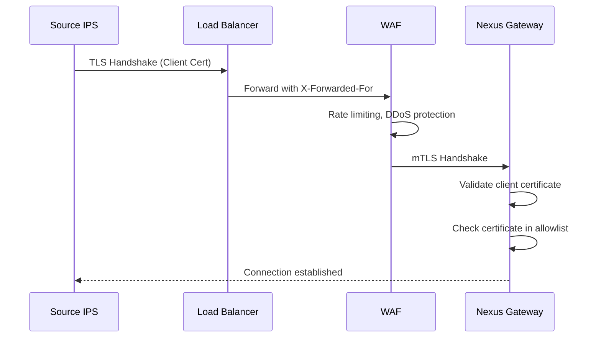
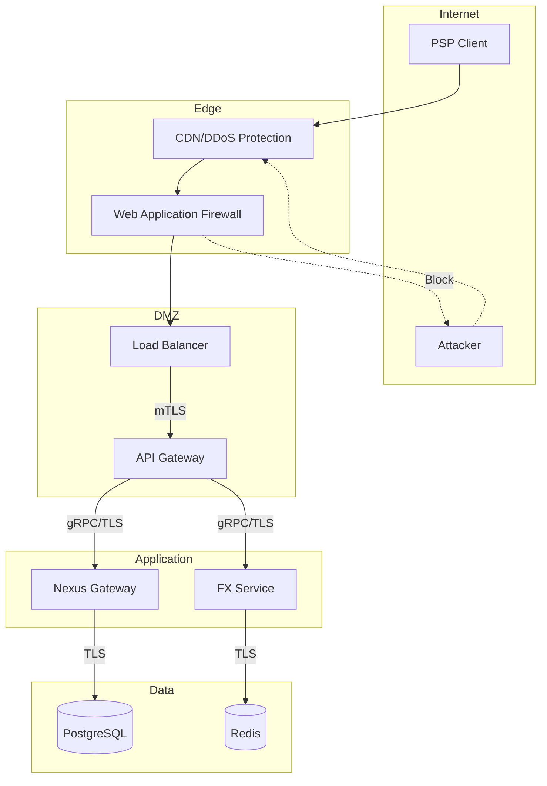

# Security Model: Nexus Global Payments

> This document defines the security architecture, authentication/authorization patterns, compliance requirements, and threat mitigations for the Nexus Global Payments platform.

## Executive Summary

Nexus Global Payments handles cross-border financial transactions across multiple jurisdictions. The security model implements defense-in-depth with:

- **Zero-trust architecture** between all system components
- **mTLS** for all inter-service and IPS-to-Gateway communication
- **FATF Recommendation 16** compliance for sender/recipient data
- **GDPR/PDPA** compliant data handling for EU/ASEAN operations
- **Event sourcing** for immutable audit trails

---

## 1. Authentication Architecture

### 1.1 IPS-to-Gateway Authentication



| Authentication Method | Use Case | Implementation |
|-----------------------|----------|----------------|
| **mTLS (X.509)** | IPS → Gateway | Client certificates signed by Nexus CA |
| **mTLS (X.509)** | Gateway → IPS | Nexus certificate signed by trusted CA |
| **OAuth 2.0** | PSP → Nexus APIs | Client credentials grant for API access |
| **API Keys** | FXP → Rate submission | HMAC-signed requests with rotating keys |

### 1.2 Certificate Management

```yaml
# Certificate hierarchy
nexus-root-ca (offline, HSM-protected)
├── nexus-intermediate-ca (online)
│   ├── nexus-gateway.pem (gateway server cert)
│   ├── source-ips-{country}.pem (client certs for each IPS)
│   └── destination-ips-{country}.pem
└── nexus-api-ca (for REST API)
    ├── psp-{bic}.pem
    └── fxp-{id}.pem
```

**Certificate Requirements:**
- RSA 2048-bit minimum (RSA 4096 recommended)
- ECDSA P-256/P-384 for new certificates
- Certificate validity: 1 year maximum
- OCSP stapling required
- CRL distribution points configured

### 1.3 OAuth 2.0 for API Access

```
┌─────────────┐    ┌─────────────┐    ┌─────────────┐
│    PSP      │    │ Nexus Auth  │    │  Nexus API  │
│  Application│    │   Server    │    │   Gateway   │
└──────┬──────┘    └──────┬──────┘    └──────┬──────┘
       │ 1. Client Credentials Grant          │
       ├──────────────────►                   │
       │ 2. Access Token (JWT)                │
       │◄──────────────────                   │
       │ 3. API Request + Bearer Token        │
       ├──────────────────────────────────────►
       │ 4. Validate Token, Authorize         │
       │                                      │
       │ 5. Response                          │
       │◄──────────────────────────────────────
```

**JWT Claims:**
```json
{
  "iss": "https://auth.nexusglobalpayments.org",
  "sub": "psp:ABCDSGSG",
  "aud": "https://api.nexusglobalpayments.org",
  "exp": 1735689600,
  "iat": 1735686000,
  "scope": "quotes:read payments:write proxy:resolve",
  "psp_id": "12345",
  "country": "SG",
  "role": "source_psp"
}
```

---

## 2. Authorization Model

### 2.1 Role-Based Access Control (RBAC)

| Role | Permissions | Actors |
|------|-------------|--------|
| **SOURCE_PSP** | `quotes:read`, `proxy:resolve`, `payments:submit`, `fees:read` | Sender's PSP |
| **DESTINATION_PSP** | `payments:receive`, `payments:accept`, `payments:reject` | Recipient's PSP |
| **FXP** | `rates:write`, `rates:delete`, `quotes:view`, `notifications:receive` | FX Providers |
| **SAP** | `payments:process`, `accounts:manage`, `camt054:receive` | Settlement Access Providers |
| **IPSO** | `participants:manage`, `routing:configure`, `metrics:view` | IPS Operators |
| **NEXUS_ADMIN** | `*` | Nexus operations team |

### 2.2 Attribute-Based Access Control (ABAC)

```python
# Example policy: PSP can only submit payments from their own country
def can_submit_payment(psp, payment):
    return (
        psp.role == "SOURCE_PSP" and
        psp.country == payment.source_country and
        psp.bic == payment.source_psp_bic and
        psp.is_active == True and
        payment.amount <= psp.max_transaction_limit
    )
```

### 2.3 API Scope Definitions

| Scope | Description | Allowed Operations |
|-------|-------------|-------------------|
| `quotes:read` | Read FX quotes | `GET /quotes`, `GET /quotes/{id}` |
| `quotes:intermediary` | Read intermediary agents | `GET /quotes/{id}/intermediary-agents` |
| `payments:submit` | Submit payments | `POST /payments` (via IPS) |
| `proxy:resolve` | Resolve proxies | `POST /proxy/resolve` |
| `fees:read` | Read fee calculations | `GET /fees-and-amounts` |
| `rates:write` | Submit FX rates | `POST /rates` |
| `rates:delete` | Withdraw FX rates | `DELETE /rates` |

---

## 3. Data Protection & Privacy

### 3.1 Data Classification

| Classification | Examples | Encryption | Retention |
|----------------|----------|------------|-----------|
| **CONFIDENTIAL** | PAN, passwords, private keys | AES-256-GCM (at rest + transit) | Minimal |
| **RESTRICTED** | Customer names, account numbers | AES-256-GCM | 7 years |
| **INTERNAL** | Transaction IDs, rates | TLS 1.3 (transit only) | 7 years |
| **PUBLIC** | Country lists, currency codes | None required | Indefinite |

### 3.2 GDPR/PDPA Compliance

| Requirement | Implementation |
|-------------|----------------|
| **Lawful basis** | Contractual necessity for payment processing |
| **Data minimization** | Only collect data required for payment |
| **Purpose limitation** | Proxy data used only for routing; no secondary use |
| **Right to erasure** | Anonymization after 7-year retention period |
| **Data portability** | Export via camt.054 statements |
| **Cross-border transfer** | SCCs between participating jurisdictions |

### 3.3 Encryption Standards

```yaml
# Transport Layer Security
tls_version: "1.3"
cipher_suites:
  - TLS_AES_256_GCM_SHA384
  - TLS_CHACHA20_POLY1305_SHA256
  - TLS_AES_128_GCM_SHA256
certificate_transparency: required

# Data at Rest
database_encryption: "AES-256-XTS (Transparent Data Encryption)"
key_management: "AWS KMS / Azure Key Vault / HashiCorp Vault"
key_rotation: "Annual or on compromise"

# Application Layer
field_level_encryption:
  - field: debtor_name
    algorithm: AES-256-GCM
    key_source: vault
  - field: creditor_account
    algorithm: AES-256-GCM
    key_source: vault
```

---

## 4. Compliance Requirements

### 4.1 FATF Recommendation 16 (Travel Rule)

All `pacs.008` messages MUST include:

**Sender (Debtor) Information:**
- Full name
- Account number
- Address OR Date/place of birth OR National ID

**Recipient (Creditor) Information:**
- Full name
- Account number

```xml
<!-- pacs.008 example -->
<Dbtr>
  <Nm>John Smith</Nm>
  <PstlAdr>
    <StrtNm>123 Main Street</StrtNm>
    <TwnNm>Singapore</TwnNm>
    <Ctry>SG</Ctry>
  </PstlAdr>
</Dbtr>
<DbtrAcct>
  <Id>
    <IBAN>SG12BANK123456789012</IBAN>
  </Id>
</DbtrAcct>
```

### 4.2 Sanctions Screening Responsibility

| Actor | Screening Obligation |
|-------|---------------------|
| **Source PSP** | Screen Sender (always) + Recipient (before pacs.008) |
| **Destination PSP** | Screen Recipient and payment |
| **SAP** | Screen payment if required by local regulations |
| **FXP** | Generally NOT required (no Sender/Recipient visibility) |

### 4.3 Audit Trail Requirements

All system changes and payment events logged with:
- Timestamp (ISO 8601 with timezone)
- Actor identity (BIC, user ID, system component)
- Action type (CRUD operation or event type)
- Before/after state (for mutations)
- Correlation ID (for distributed tracing)

---

## 5. Threat Model (STRIDE Analysis)

### 5.1 Spoofing

| Threat | Mitigation |
|--------|------------|
| Fake IPS impersonation | mTLS with certificate pinning |
| Stolen API credentials | Short-lived tokens, IP allowlisting |
| Replay attacks | UETR uniqueness, timestamp validation |

### 5.2 Tampering

| Threat | Mitigation |
|--------|------------|
| Message modification in transit | TLS 1.3 integrity |
| Database modification | Event sourcing (immutable events) |
| Quote manipulation | Signed quotes with HMAC |

### 5.3 Repudiation

| Threat | Mitigation |
|--------|------------|
| Denial of payment submission | Immutable event log with actor ID |
| Dispute over FX rates | Quote snapshot stored at payment time |

### 5.4 Information Disclosure

| Threat | Mitigation |
|--------|------------|
| Customer data exposure | Field-level encryption, access controls |
| Rate information leak | Encrypted storage, audit logging |
| Network sniffing | mTLS everywhere |

### 5.5 Denial of Service

| Threat | Mitigation |
|--------|------------|
| Volumetric DDoS | Cloud WAF, rate limiting, autoscaling |
| Application-layer DoS | Request validation, circuit breakers |
| Quote flooding | Per-PSP rate limits |

### 5.6 Elevation of Privilege

| Threat | Mitigation |
|--------|------------|
| Token scope escalation | Strict scope validation per endpoint |
| Role manipulation | Immutable role assignment, MFA for admin |
| Insider threat | Principle of least privilege, audit logging |

---

## 6. Security Controls Matrix

### 6.1 Network Security



### 6.2 Application Security

| Control | Implementation |
|---------|----------------|
| Input validation | JSON Schema validation, XSD for ISO 20022 |
| Output encoding | XML entity encoding, JSON escaping |
| SQL injection prevention | Parameterized queries, ORM |
| Rate limiting | Token bucket per PSP, global limits |
| Error handling | Generic error messages, detailed internal logs |

### 6.3 Security Headers

```yaml
# Response headers for API
Content-Security-Policy: "default-src 'none'"
X-Content-Type-Options: "nosniff"
X-Frame-Options: "DENY"
Strict-Transport-Security: "max-age=31536000; includeSubDomains; preload"
Cache-Control: "no-store"
```

---

## 7. Incident Response

### 7.1 Security Incident Classification

| Severity | Description | Response Time |
|----------|-------------|---------------|
| **P1 - Critical** | Active breach, data loss, payment fraud | 15 minutes |
| **P2 - High** | Vulnerability exploited, unauthorized access | 1 hour |
| **P3 - Medium** | Attempted breach, policy violation | 4 hours |
| **P4 - Low** | Suspicious activity, vulnerability discovered | 24 hours |

### 7.2 Incident Response Procedure

1. **Detection** - SIEM alert, user report, or automated detection
2. **Containment** - Isolate affected systems, revoke credentials
3. **Eradication** - Remove threat, patch vulnerability
4. **Recovery** - Restore services, verify integrity
5. **Post-incident** - Root cause analysis, update controls

---

## 8. Compliance Certifications (Target)

| Certification | Scope | Status |
|---------------|-------|--------|
| ISO 27001 | Information Security Management | Target |
| SOC 2 Type II | Security, Availability, Confidentiality | Target |
| PCI DSS | Payment data handling (if applicable) | Target |
| GDPR | EU data protection | Required |
| PDPA | Singapore data protection | Required |

---

## Related Documents

- [C4 Architecture](../architecture/C4_ARCHITECTURE.md)
- [Kubernetes Security](../infrastructure/KUBERNETES_DEPLOYMENT.md#security)
- [Observability & Audit](../infrastructure/OBSERVABILITY.md)

---

*Security model aligned with OWASP guidelines, NIST Cybersecurity Framework, and financial services best practices.*
